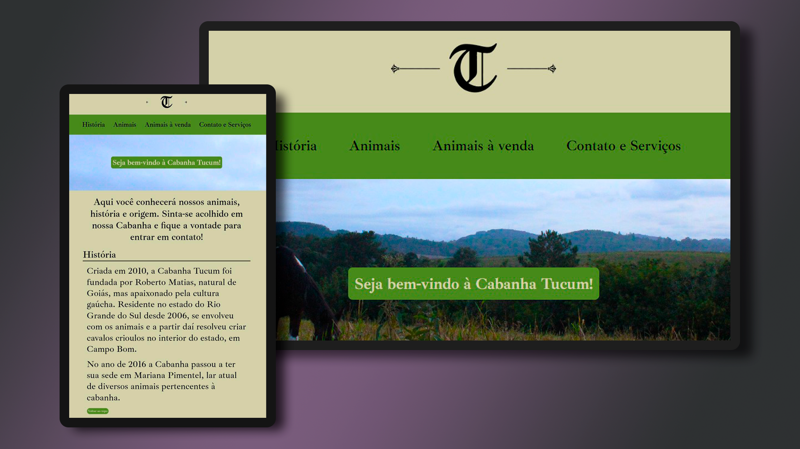

# cabanha-tucum

<h1 align="center"> Cabanha Tucum </h1>

Landing page com design e desenvolvimento autoral, destinado à promoção da Cabanha Tucum.

 

  

## 🚀 Tecnologias

Esse projeto foi desenvolvido com as seguintes tecnologias:

- HTML e CSS
- Git e Github
- Figma e Photoshop

## 💻 Projeto

Landing page da Cabanha Tucum, sob encomenda do proprietário.
Desenvolvimento, design e fotografia autorais.
O intuito do projeto é apresentar o catálogo de animais na cabanha, com capacidade de redirecionar o usuário ao site da ABCCC ou ao contato do proprietário, a fim de contratar serviços ou comprar animais.

## ☝️ Desenvolvimento

Uso exclusivo das tecnologias HTML e CSS para desenvolvimento do site, com intuito de aprofundar conhecimentos acerca dos mecanismos, abrangendo positions e displays, uso correto de tags e reconhecimento da responsividade.